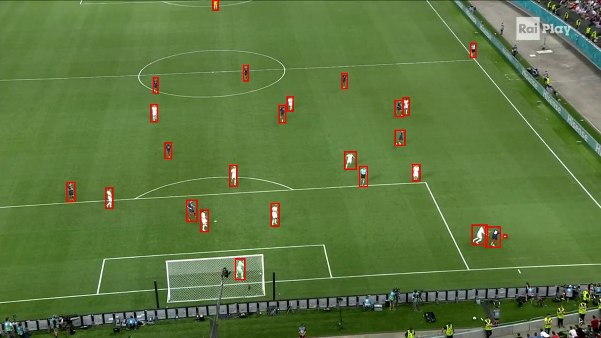
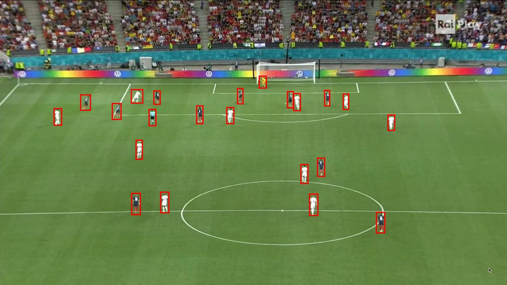

# Vision Analytics Hub

A versatile computer vision analytics platform that combines modern CV algorithms with an interactive web interface. Upload any dataset, visualize results, and analyze patterns through our comprehensive suite of computer vision tools.

## Key Features (In Development)
- 🔍 Universal Object Detection & Tracking
- 📊 Real-time Data Visualization
- 🎯 Custom Model Integration
- 🖼️ Support for Various Data Types:
  - Images
  - Videos
  - Real-time Streams
  - Custom Data Sources

## Architecture
- **CV Pipeline:** YOLOv8, OpenCV
- **Frontend:** React-based dashboard
- **Backend:** FastAPI/Flask
- **Analytics:** Custom visualization tools using D3.js/Three.js

## Project Status
🚧 Active Development: Core features are being implemented and the architecture may evolve.

## Quick Start

1. Clone and install:
   ```sh
   git clone <repository-url>
   cd <repository-directory>
   ```
2. Install the required dependencies:
   ```sh
   pip install -r requirements.txt
   ```

## Usage

1. Run the training script to train the model on the custom dataset:
   ```sh
   python train.py
   ```
2. Use the model for inference to detect objects in new images:
   ```sh
   python main.py
   ```

## Results

Here are some example results from the model:




The model successfully detects football players and the ball in the images, as shown in the results above.
